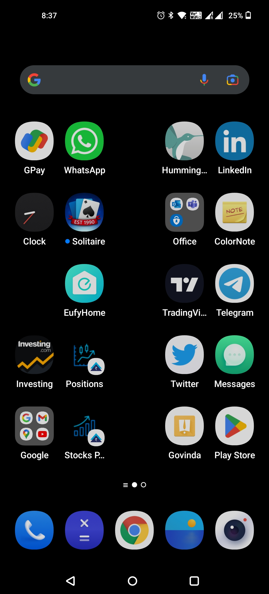

# How to download WhatsApp on Android Phone and Android Tablet - User Guide

## Introduction

WhatsApp is an internationally available freeware, cross-platform centralized, instant messaging and voice-over-IP service owned by Meta Platforms.
It allows users to send text messages and voice messages, make voice and video calls, and share images, documents, user locations, and other content. WhatsApp's client application runs on mobile devices but is also accessible from desktop computers. The service requires a cellular mobile telephone number to sign up.

## System Pre-requisite

### Required Condition

Makesure that your device is connected to the Internet.

### Operating System Requirements

Android OS 4.0.3 or greater

### Hardware Requirements
* 1GB RAM or greater
* Recommended 16GB internal stroage or greater
* Camera
* Microphone
* Voice and SMS supportive device
* Data/Wi-Fi® support device

## End User

Everyone

## Procedure

1.  Open the Play Store application on your Android phone or tablet.<figure>

</figure>

2.  In the search box, search WhatsApp Messenger.

3.  Select the application from the search results.

    *Note: WhatsApp download page will open in the Play Store.*
4. Click on the **Install** button.

    *Notes:*
    *   *WhatsApp will start to download.*
    *   *WhatsApp is free to download.*
5.  Click on **Open** button, After the App got installed successfully on your device.
    